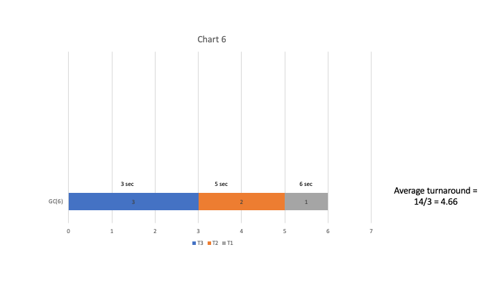

1. What is the difference between an operating system and middleware?

    An operating system is the software that utilizes a computer's hardware to support the execution of other software. On the other hand, middleware is also software which exists between applications by acting as a layer on top of the operating system. In this sense, it is a go-between for the applications and the OS. However, they are distinct because they rely on different underlying providers of lower-level services. Furthermore, an operating system relies on the features of the computer's hardware to carry out the functions in its API, where middleware makes use of OS features to carry out the services in its API. 

2. What is the relationship between threads and processes?

    A thread is a sequence of programmed actions, where a process contains many threads that ensures that there are no unwanted interactions between threads.

3. Of all the topics previewed in chapter one of the text book, which one are you most looking forward to learning more about? Why? 

    Of all the topics that were covered in chapter one the one that we are most interested in learning about is the scheduling of threads that will be talked about in chapter three.  We are curious to learn how each processor will choose which thread to pay attention to at each moment and why those decisions are made. This is because in the book the author mentions that even though there are many solutions to this problem, there really isn't one solution that is going to "keep everyone happy all the time", so we would want to know what approaches are taken to at least try to keep users happy.   

4. Suppose thread A goes through a loop 100 times, each time performing one disk I/O operation, taking 10 milliseconds, and then some computation, taking 1 millisecond. While each 10-millisecond disk operation is in progress, thread A cannot make any use of the processor. Thread B runs for 1 second, purely in the processor, with no I/O. One millisecond of processor time is spent each time the processor switches threads; other than this switching cost, there is no problem with the processor working on thread B during one of thread A's I/O operations. (The processor and disk drive do not contend for memory access bandwidth, for example.)

    a) Suppose the processor and disk work purely on thread A until its completion, and then the processor switches to thread B and runs all of that thread. What will the total elapsed time be?

        Thread A: 10 ms + 1 ms = 11 ms x 100 = 1100 ms
        Switch:                                   1 ms
        Thread B:                   +  1 sec = 1000 ms 
                                       ----------------
                                               2101 ms = 2.101 sec
    b) Suppose the processor starts out working on thread A, but every time thread A performs a disk operation, the processor switches to B during the operation and then back to A upon the disk operation's completion. What will the total elapsed time be?

        Thread A: 10 ms
        Switch:    1 ms
        Thread B: 10 ms (-10 ms) <- doesn't add anymore time because threads A & B are running at the same time 
        Switch:    1 ms 
        Thread A:  1 ms 
                 --------
                  13 ms x 100 = 1300 ms = 1.3 sec 
    c) In your opinion, which do you think is more efficient, and why?

    In the obvious sense, running each thread to completion is much slower than running the threads concurrently. In this regard, I believe it is more efficient to switch between the threads. This is due to the fact that thread A cannot make use of the processor while the disk operation is in progress. Therefore, it is more efficient to make use of the processor by switching to and running thread B during this time.

5. Done in separate file 

6.  Suppose a system has three threads (T1, T2, and T3) that are all available to run at time 0 and need one, two, and three seconds of processing, respectively. Suppose each thread is run to completion before starting another. Draw six different Gantt charts, one for each possible order the threads can be run in. or each chart, compute the turnaround time of each thread; that is, the time elapsed from when it was ready (time 0) until it is complete. Also, compute the average turnaround time for each order. Which order has the shortest average turnaround time? What is the name of the scheduling policy that produces this order?

    The order shown in chart 1, T1 followed by T2 and then by T3, had the shortest average turnaround time of 3.33 seconds. The scheduling policy that minimizes the average response time and produces this order is called Shortest Job First [SJF] scheduling.

7. Done in separate file 
