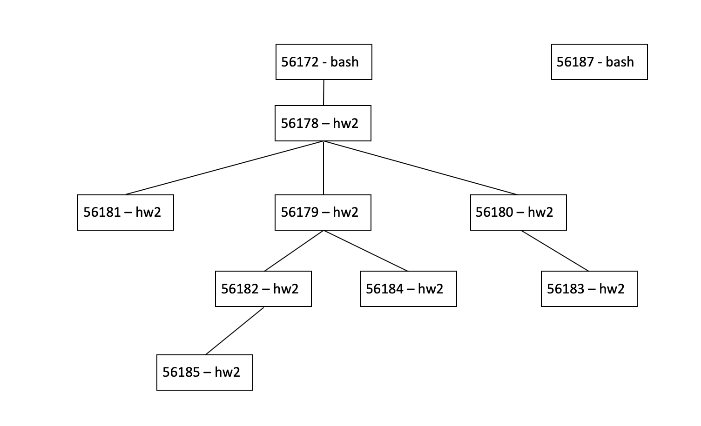

# Homework 02

1. In the mutex-locking pseudocode of Figure 4.10 on page 111, there are two consecutive steps that remove the current thread from the runnable threads and then unlock the spinlock. Because spinlocks should be held as briefly as possible, we ought to consider whether these steps could be reversed, as shown in Figure 4.28 [on page 148]. Explain why reversing them would be a bad idea by giving an example sequence of events where the reversed version malfunctions.

Reversing these two steps would be a bad idea because a thread has to make itself not runnable by removing itself from the runnable threads queue before it unlocks the spinlock. If it fails to do this it would start running the same thread from runnable threads immediately after unlocking. For example, suppose thread A is trying to decrement a seat remaining in a sell ticket procedure. If that thread dispenses a ticket and decreases the count of seats remaining and then unlocks before removing itself from runnable threads, it will run again, updating the counts to inaccurate data.

2. Suppose the first three lines of the audit method in Figure 4.27 on page 144 were replaced by the following two lines:
```
int seatsRemaining = state.get().getSeatsRemaining();
int cashOnHand = state.get().getCashOnHand();
```
Explain why this would be a bug.

This would be a bug because if the state changes between the time getSeatsRemaining() is called and getCashOnHand() is called then seatsRemaining would refer to a different state than cashOnHand, instead of both variables referring to the same state as intended. 

3. Program can be found in BoundedBuffer.java

4. Program can be found in BoundedBuffer4.java

5. Suppose T1 writes new values into x and y and T2 reads the values of both x and y. Is it possible for T2 to see the old value of x but the new value of y? Answer this question three times: once assuming the use of two-phase locking, once assuming the read committed isolation level is used and is implemented with short read locks, and once assuming snapshot isolation. In each case, justify your answer.

No, with two-phase locking T2 will only see the most recent value of x and y because each read sees the most recently written value after T1 is through writing. On the other hand, with read committed isolation and short read locks it is possible for T2 to read an old value of x but the new value of y. This is because the transaction can acquire a shared lock before each read operation and then  release it immediately after the read. Additionally, this is also possible with snapshot isolation. This is because each write action stores the new value for a variable in a different location than the previous value. Therefore, a read action can read older versions of an entity. 

6. Assume a page size of 4 KB and the page mapping shown in Figure 6.10 on page 225. What are the virtual addresses of the first and last 4-byte words in page 6? What physical addresses do these translate into?

The virtual address for the first 4-byte word of page 6 is __12288__ and the one for the last 4-byte words of page 6 is __16380__. These virtual addresses translate to the physical addresses: 12288+4096=__16384__ for the first 4-byte word and 16380+4096=__20476__ for the last 4-byte word. 

7. At the lower right of Figure 6.13 on page 236 are page numbers 1047552 and 1047553. Explain how these page numbers were calculated.

In figure 6.13, the page numbers 1047552 and 1047553 were calculated because the last page is 1023, so if you multply 1023 by 1024 (because pages can point to 1024 page frames) you get those pages. 

8. Write a program that loops many times, each time using an inner loop to access every 4096th element of a large array of bytes. Time how long your program takes per array access. Do this with varying array sizes. Are there any array sizes when the average time suddenly changes? Write a report in which you explain what you did, and the hardware and software system context in which you did it, carefully enough that someone could replicate your results.  

To write this program, I first used classwork 6 in which we had already ceated a timer for an array of bytes. The difference is that in this program I timed how long it took to access every 4096th element in the array. To do that, I made a loop that started of at 0 and then added 4096 everytime it ran (accessing the 4096th element every time). In the loop, I first started the clock and then I accessed the array at the element i, then once the element had been accessed the clock was stopped. I then had an array of times that contained the cpu time used everytime the loop was run. To get the average sum, I added together all of the times stored in the times array and then divided that by the length of the array. My program prints the size allocated (which is passed in on the command line), the times array, and at the end the average time. I am running this program on a mac. 

9. Figure 7.20 [page 324] contains a simple C program that loops three times, each time calling the fork() system call. Afterward it sleeps for 30 seconds. Compile and run this program, and while it is in its 30-second sleep, use the ps command in a second terminal window to get a listing of processes. How many processes are shown running the program? Explain by drawing a family tree of the processes, with one box for each process and a line connecting each (except the first one) to its parent.

10 processes are shown in the terminal, 2 from bash and the other 8 from the "C" program.
