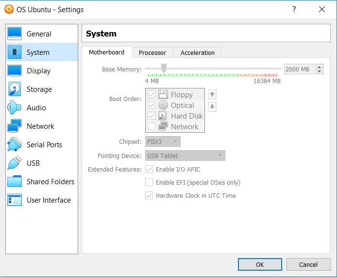

# Kernel Modification Tutorial

## Set up Your VM

In order to complete this kernel modification, you should have Oracle Virtual Box installed. You can download the VM at this [link](https://www.virtualbox.org/wiki/Downloads).

Notes:
1. Your VM will need about 40GB of storage (I recommend no less than that). This can be set during set up of your machine when you are asked for file location and size.
    
2. Your VM will need at least 2000MB of memory. You can set this while your VM is not running by selecting your VM then going selecting Settings. In the settings pop-up, click System on the left-hand side then on the Motherboard tab.
    

## Build the Kernel

To build the kernel, I followed this tutorial until step 9 where you test the system call. Before this step, I got an error upon rebooting my kernel that looked like this:
> [ end Kernel panic - not syncing: System is deadlocked on memory]

To fix this, follow step 2 of the notes.

Now, you can follow the rest of the tutorial to get a hello world syscall and compile the kernel.

# Implementing Our Custom System Call: processInfo

This system call will display the PID (process ID), the process' state, priority, number of children, start time, time spent in user mode, time spent in system mode, and the user ID of the process owner. I will paste and explain the code below.

```C
#include<linux/kernel.h>
#include<linux/init.h>
#include<linux/sched.h>
#include<linux/syscalls.h>

#include "processInfo.h"

asmlinkage long sys_listProcessInfo(void) {

    struct task_struct *task;

    for_each_process(task) {

	    printk(
	      "Process: %s\n \
	       Process ID: %ld\n \
	       Process State: %ld\n \
	       Priority: %ld\n \
	       Start Time: %llu\n \
	       Time in User Mode: %ld\n \
	       Time in System Mode: %ld\n", \
	       task->comm, \
	       (long)task_pid_nr(task), \
	       (long)task->state, \
	       (long)task->prio, \
		task->start_time,
	       (long)task->utime, \
	       (long)task->stime
	    );

  }

  return 0;
}

```

To test this syscall, we made a c program called test.c that simply calls our syscall and outputs whether or not it ran.

```C
#include <stdio.h>
#include <linux/kernel.h>
#include <sys/syscall.h>
#include <unistd.h>

int main()
{  
    printf("Invoking 'listProcessInfo' system call\n");
         
    long int ret_status = syscall(549); // 549 is the syscall number
         
    if(ret_status == 0) 
         printf("System call 'listProcessInfo' executed correctly.\n Use dmesg to check processInfo\n");
    
    else 
         printf("System call 'listProcessInfo' did not execute as expected\n");
          
     return 0;
}
```
