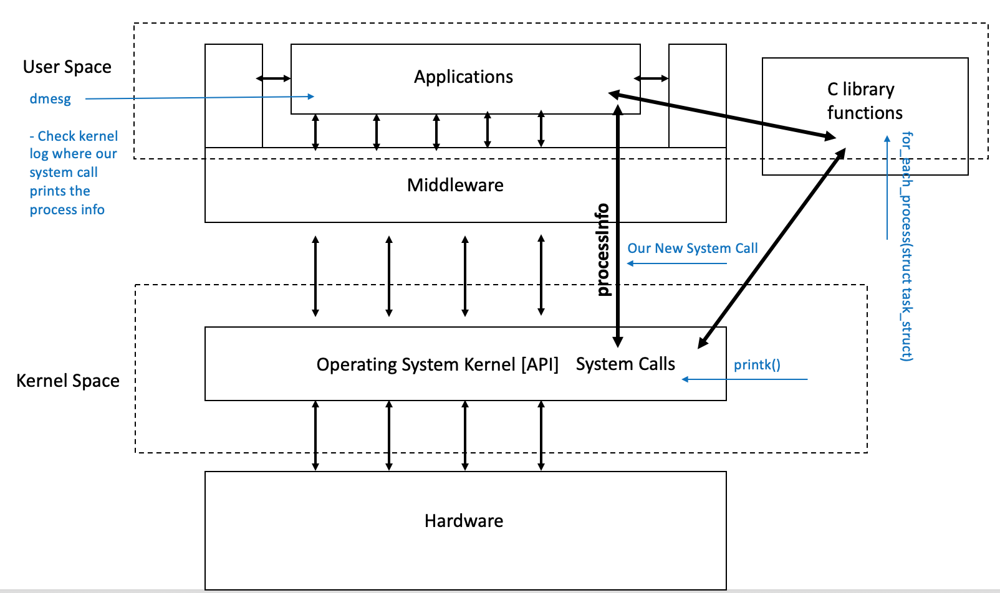

#### 2.1 – Detailed list of Linux modules that will be modified/affected

For our kernel modification project we will not be modifying any Linux modules. We will however be relying on existing kernel functionality and library functions in order to implement our new system call (see diagram below).

#### 2.2 – Detailed list of any new modules that you will produce [or 'Not Applicable' if there are none]

For our project we will be creating a new processInfo module. This module will implement a new system call that loops through all of the processes and prints out information to the kernel log about said processes. This information is accessed from the task_struct, which is an internal data structure that stores process details. Our new system call function will make use of asmlinkage, which informs the compiler to look at the CPU's stack for the function parameters, rather than supplying them ourselves. The specific information that will be supplied from this system call consists of the PID, the process' state, priority, number of children, start time, time spent in user mode, time spent in system mode, and the user ID of the process owner. 

#### 2.3 - Class diagram showing affected modules [and any new modules] and how they related to one another

 

#### 2.4 – List or table of explanations of all command line options that will be implemented

The new system call that we create will not be executed from the command line but rather from a test file that calls it from a specific syscall value. From here, the information that it outputs to the kernel log can be checked using the 'dmesg' command, which brings up said logs within the terminal. 
